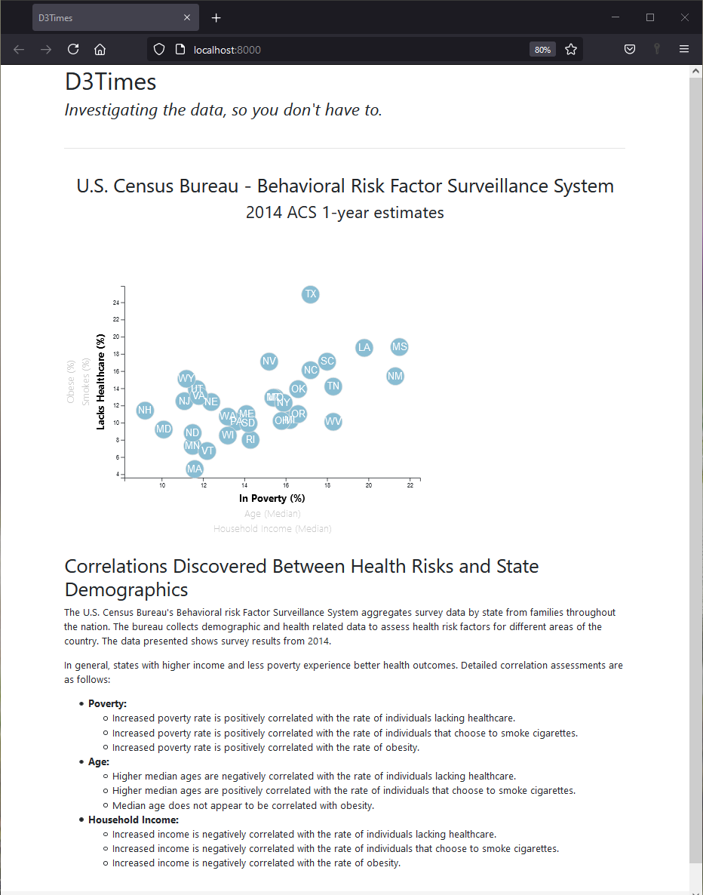

# D3-challenge
UofA Data Analytics Bootcamp Homework Assignment 16-D3

### Assignment Description
Build a responsive webpage that displays health risk data selected by the user when they click on the axis labels or hover over a datapoint.

### Tools Utilized
| Webpage | User Interface |
|----------|----------|
| HTML | Javascript |
| CSS | D3.js |
| Bootstrap |  |

### Project Content Descriptions
* assignment_instructions: Instructions, data and starter code for completing the assignment.
* D3_data_journalism: project code
    * css: CSS style sheets for the webpage.
    * data: CSV formatted data used by the webpage.
    * scripts: Javascript code for building the interactive webpage.
    * index.html: HTML code for the interactive webpage.
* images: Webpage screenshots.
* LICENSE: MIT License Disclosure

### Run Instructions
1. Open terminal
    a. Navigate to the D3_data_journalism folder
    b. Run "python -m http.server" 
2. Open browser
    a. Navigate to <a href="http://localhost:8000/" target="_blank">http://localhost:8000/</a>
    b. Hover over the data bubbles to see detailed state data.
    c. Click on different axis labels to change the displayed data.

### Completed Webpage

### Source Data and Starter Code
* Provided by UofA Data Analytics Bootcamp